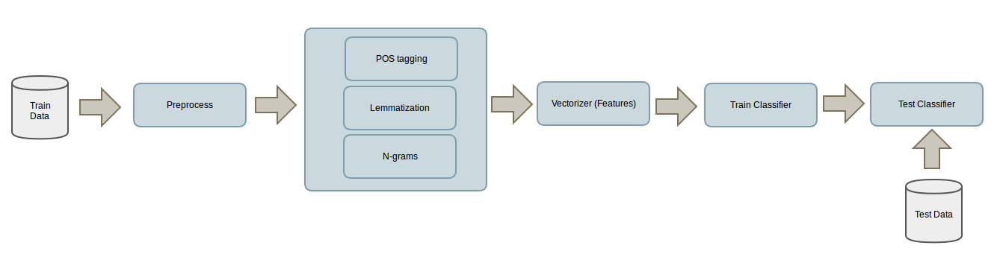
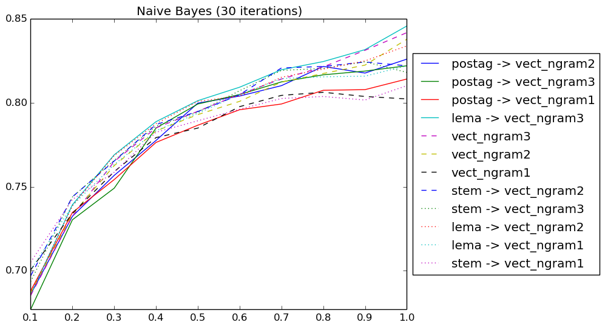
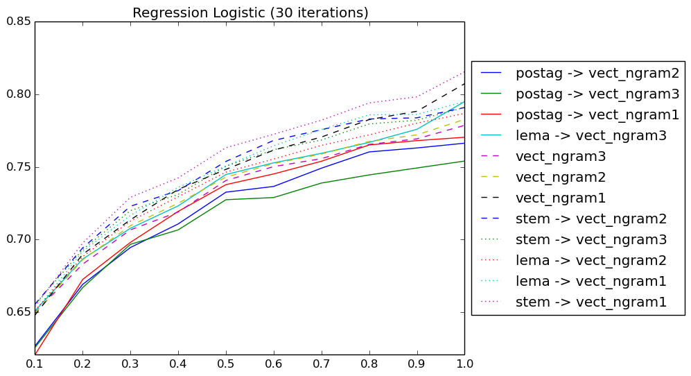
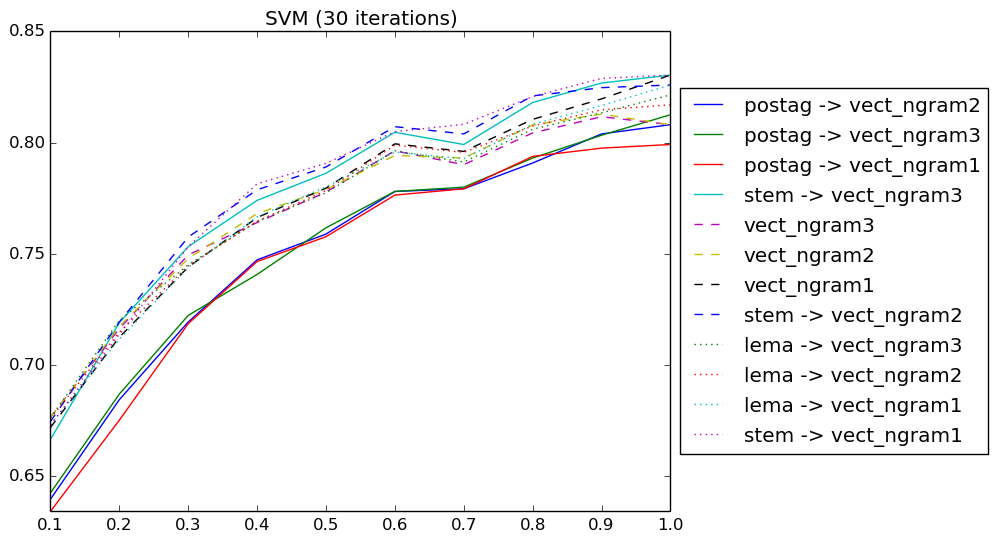
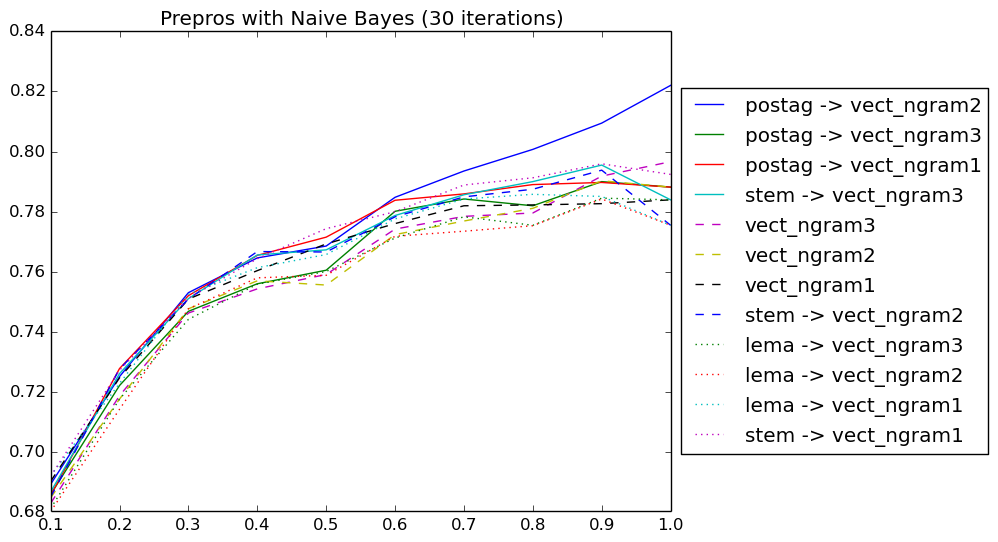
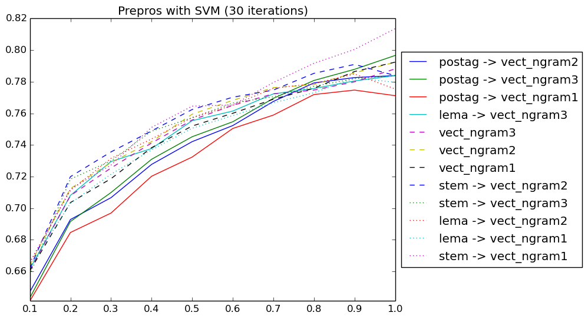
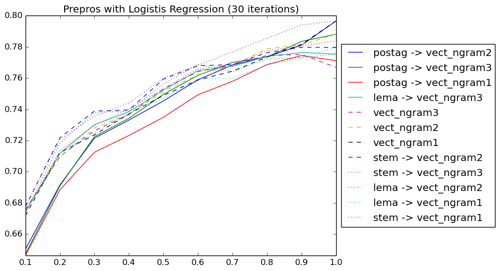

# pyAnaSent
Analysis of different strategies of NLP techniques to sentiment classification

In this work the impact of three different NLP techniques are analysed:
 
- Lemmatization and stemming: reduce inflectional forms and sometimes derivationally related forms of a word to a common base form. For instance:

```
    am, are, is $\Rightarrow$ be
    car, cars, car's, cars' $\Rightarrow$ car 
```
 
- POS-Tagging (part-of-speech tagging): is the process of marking up a word in a text as corresponding to a particular part of speech. For instance:

```
    Maybe/RB not/RB the/DT most/RBS efficient/JJ way/NN to/TO browse,/NNP but/CC fun:/NNP #Google/JJ releases/NNS an/DT Infinite/NNP Digital/NNP Bookcase/NNP by/IN @MeghanKel/NNP
```

- N-grams: contiguous sequence of n words from a given sequence of text. For instance in the previous sentence "Maybe not the" is a 3-gram and "to browse" is a 2-gram.


## Dataset

The Sanders-Twitter Sentiment Corpus (Niek J. Sanders) is used for the experiments. It consists of 5513 hand-classified tweets. These tweets were classified with respect to one of 4 different topics. 
Four classifications are used in this corpus: irrelevant, neutral, positive and negative. Only the tweets classified as positive or negative have been used (4592).

## Methodology

For the classification stage is necessary to create a feature vector for each tweet. The CountVectorizer of the sklearn library will be used. This create a vector of tokens count. The size of this vector will be the size of the vocabulary used.



How baseline level of accuracy the pipeline without any technique will be used, so only will be applied Preprocess -> Vectorizer -> Train ...

For testing the classifiers, the 25% of the corpus will be used. The 75% remaining will be reserved for training. For make the graph a part of that 75% will be used, so the X axis represent the size of the training dataset over the total. 
In addition, multiples iterations over the same size of the training dataset will be perform.

## Framework

The central component is the ModelAnalizer class. This class receives a sklearn pipeline list (preprocessors, transformers and vectorizers) and a classifiers list. It trains the classifiers employing each pipeline and scores it using the test data.

During the train process for each pipeline the better parameters are searched using the GridSearchCV class. It do a exhaustive search over specified parameter values for a classifier and is optimized by cross-validation.

## Results

Using Naive Bayes classifier the better results are obtaining using Lematizations and 3-gram before to vectorizer. In this case this pipeline is very stable keeping the better results for all sizes of the training dataset.

Use only 3-gram or 2-gram before to vectorizer obtain good results too. On the other hand, the POS-tagging do very poor results in general.



Using Logistic Regression the results a litter different. However the better results are obtained by Lematization and 2-gram, very similar to previous results. Is interesting that the next top results 
are obtained by the baseline. Again the worse results are obtained by the POS-tagging method.



Finally, using SVM the results are very similar. In this case Streamming/Lematization + 2gram/3gram get the better results. The POS-tagging techniques continue being the worse.




However, it's reasonable to think that the performance is related with the pre-processing stage. So, previously only the # and @ symbols have been removed. It's possible to do other cleans. For instance, 
swap the emoticons by words that define it:

    emoticons = {"happy": ":-) :) :D :o) :] :3 :c) :> =] 8) =) :} :^) :っ) :-))",
             "laughing" : ":-D 8-D 8D x-D xD X-D XD =-D =D =-3 =3 B^D",
             "sad" : ">:[ :-( :(  :-c :c :-<  :っC :< :-[ :[ :{",
             "crying" : ":'-( :'( :,(",
             "surprise" : ">:O :-O :O :-o :o 8-0 O_O o-o O_o o_O o_o O-O",
             "kiss": ":* :^* ( '}{' )",
             "tongue" : ">:P :-P :P X-P x-p xp XP :-p :p =p :-Þ :Þ :þ :-þ :-b :b d:"}
             
or remove the links. So, the next charts show the results obtained swapping the emoticons and removing the links.

Now, the POS-tagging techniques have improved the performance become the POS-tagging + 3-gram the choice more correct.
 







## Conclusions

In general, POS-tagging and lematization are good techniques that improving the baseline pipeline. If that strategies are combined with 2-gram and 3-gram is possible improve the result even more. 
On the other hand, the choice between POS-tagging or lematization depends of the data and the pre-processing stage.