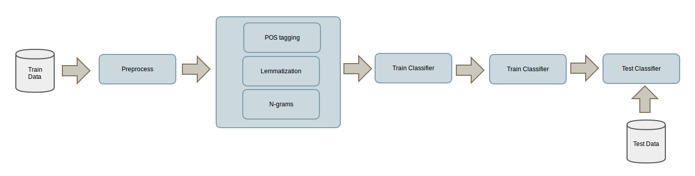

# pyAnaSent
Analysis of different strategies of NLP techniques to sentiment classification

In this work we are analysing the impact of three different NLP techniques:
 
- Lemmatization and stemming: reduce inflectional forms and sometimes derivationally related forms of a word to a common base form. For instance:

```
    am, are, is $\Rightarrow$ be
    car, cars, car's, cars' $\Rightarrow$ car 
```
 
- POS-Tagging (part-of-speech tagging): is the process of marking up a word in a text as corresponding to a particular part of speech. For instance:

```
    Maybe/RB not/RB the/DT most/RBS efficient/JJ way/NN to/TO browse,/NNP but/CC fun:/NNP #Google/JJ releases/NNS an/DT Infinite/NNP Digital/NNP Bookcase/NNP by/IN @MeghanKel/NNP
```

- N-grams: contiguous sequence of n words from a given sequence of text. For instance in the previous sentence "Maybe not the" is a 3-gram and "to browse" is a 2-gram.


## Dataset

The Sanders-Twitter Sentimen Corpus (Niek J. Sanders) is used for the experiments. It consists of 5513 hand-classified tweets. These tweets were classified with respect to one of 4 different topics. Four classifications are used in this corpus: irrelevant, neutral, positive and negative. Only the tweets classified as positive or negative have been used.

## Methodology

For the classification stage is necesary to create a feature vector for each tweet. The CountVectorizer of the sklearn library will be used. This create a vector of tokens count. The size of this vector will be the size of the vocabulary used.

